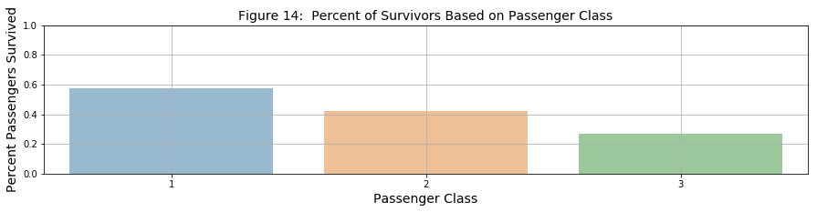
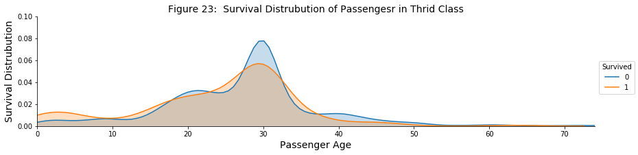

# Titanic Data Analysis (from Kaggle)

The workbook below shows a short project that analyzed the data from the Titanic dataset on the [Kaggle website](https://www.kaggle.com/c/titanic).  The goal of the project was to extract some insight on the demographics of passengers on the ship and the survival rates. 

In this project, I used the Pandas library and used Seaborn to visualize the data. While the primary goal was to analyze the data, I used this project to get comfortable with munging the data and visualizing the data at the same time.  Some of the insights found from this project is included below. 

In a follow-up project, I will take the data, and use a train-test-split to divide up the data and use a machine learning model, like logistic regression, to quantitatively find the best predictor of survival. 

### What is the relationship between people who survived and where the embarked onto the ship? Is there one city that has a higher percentage of survivors than others?

From the data, passengers from Southampton had the lowest rate of survival at 34% even though most of the passengers boarded from Southampton.  Passengers who have the highest rate of survival were from Cherbourg at nearly 50%.  The survival rate from passengers from Queenstown was 44%.  

### What is the relationship between people who survived and their passenger class on the ship? Did more first-class passengers survive over the second- and third-class passengers?

From the data, nearly 58% of all of the first class passengers survived, compared to 42% of those in second class and 27% of those in third class.  Interestingly, even though most of the passengers were in third class, they were the smallest group of passengers that survived. 

### What is the relationship between the gender of the passengers and their survival rate? Did more females survive compared to males?

Overall, females had a higher survival rate compared to men.  From the data, 82% of the females on the ship survived while only 13% of the males survived.  In addition, almost 97% of the females in first class survived, followed by 94% of the females in second class and 67% of the females in third class.

***


```python
#Standard Imports 

import pandas as pd
import matplotlib.pyplot as plt
import seaborn as sns
%matplotlib inline
```


```python
#Reference datasets 

train_url = 'http://bit.ly/titanic-001'
test_url = 'http://bit.ly/titanic-002'
survive_url = 'http://bit.ly/titanic-003'
```


```python
#Load datasets into Pandas dataframes

df_train = pd.read_csv(train_url)
df_test = pd.read_csv(test_url)
df_survive = pd.read_csv(survive_url)
```


```python
#Combine df_test and df_survive using an inner join on 'PassengerId'

test_combined_df = pd.merge(df_test, df_survive, on='PassengerId', how='inner')
test_combined_df.head()
```


<div>
<style>
    .dataframe thead tr:only-child th {
        text-align: right;
    }

    .dataframe thead th {
        text-align: left;
    }

    .dataframe tbody tr th {
        vertical-align: top;
    }
</style>
<table border="1" class="dataframe">
  <thead>
    <tr style="text-align: right;">
      <th></th>
      <th>PassengerId</th>
      <th>Pclass</th>
      <th>Name</th>
      <th>Sex</th>
      <th>Age</th>
      <th>SibSp</th>
      <th>Parch</th>
      <th>Ticket</th>
      <th>Fare</th>
      <th>Cabin</th>
      <th>Embarked</th>
      <th>Survived</th>
    </tr>
  </thead>
  <tbody>
    <tr>
      <th>0</th>
      <td>892</td>
      <td>3</td>
      <td>Kelly, Mr. James</td>
      <td>male</td>
      <td>34.5</td>
      <td>0</td>
      <td>0</td>
      <td>330911</td>
      <td>7.8292</td>
      <td>NaN</td>
      <td>Q</td>
      <td>0</td>
    </tr>
    <tr>
      <th>1</th>
      <td>893</td>
      <td>3</td>
      <td>Wilkes, Mrs. James (Ellen Needs)</td>
      <td>female</td>
      <td>47.0</td>
      <td>1</td>
      <td>0</td>
      <td>363272</td>
      <td>7.0000</td>
      <td>NaN</td>
      <td>S</td>
      <td>1</td>
    </tr>
    <tr>
      <th>2</th>
      <td>894</td>
      <td>2</td>
      <td>Myles, Mr. Thomas Francis</td>
      <td>male</td>
      <td>62.0</td>
      <td>0</td>
      <td>0</td>
      <td>240276</td>
      <td>9.6875</td>
      <td>NaN</td>
      <td>Q</td>
      <td>0</td>
    </tr>
    <tr>
      <th>3</th>
      <td>895</td>
      <td>3</td>
      <td>Wirz, Mr. Albert</td>
      <td>male</td>
      <td>27.0</td>
      <td>0</td>
      <td>0</td>
      <td>315154</td>
      <td>8.6625</td>
      <td>NaN</td>
      <td>S</td>
      <td>0</td>
    </tr>
    <tr>
      <th>4</th>
      <td>896</td>
      <td>3</td>
      <td>Hirvonen, Mrs. Alexander (Helga E Lindqvist)</td>
      <td>female</td>
      <td>22.0</td>
      <td>1</td>
      <td>1</td>
      <td>3101298</td>
      <td>12.2875</td>
      <td>NaN</td>
      <td>S</td>
      <td>1</td>
    </tr>
  </tbody>
</table>
</div>


```python
#Combine the newly formed dataframe and df_train

df = test_combined_df.append(df_train)
```


```python
#Display head of df_combined.

df.head(10)
```


<div>
<style>
    .dataframe thead tr:only-child th {
        text-align: right;
    }

    .dataframe thead th {
        text-align: left;
    }

    .dataframe tbody tr th {
        vertical-align: top;
    }
</style>
<table border="1" class="dataframe">
  <thead>
    <tr style="text-align: right;">
      <th></th>
      <th>Age</th>
      <th>Cabin</th>
      <th>Embarked</th>
      <th>Fare</th>
      <th>Name</th>
      <th>Parch</th>
      <th>PassengerId</th>
      <th>Pclass</th>
      <th>Sex</th>
      <th>SibSp</th>
      <th>Survived</th>
      <th>Ticket</th>
    </tr>
  </thead>
  <tbody>
    <tr>
      <th>0</th>
      <td>34.5</td>
      <td>NaN</td>
      <td>Q</td>
      <td>7.8292</td>
      <td>Kelly, Mr. James</td>
      <td>0</td>
      <td>892</td>
      <td>3</td>
      <td>male</td>
      <td>0</td>
      <td>0</td>
      <td>330911</td>
    </tr>
    <tr>
      <th>1</th>
      <td>47.0</td>
      <td>NaN</td>
      <td>S</td>
      <td>7.0000</td>
      <td>Wilkes, Mrs. James (Ellen Needs)</td>
      <td>0</td>
      <td>893</td>
      <td>3</td>
      <td>female</td>
      <td>1</td>
      <td>1</td>
      <td>363272</td>
    </tr>
    <tr>
      <th>2</th>
      <td>62.0</td>
      <td>NaN</td>
      <td>Q</td>
      <td>9.6875</td>
      <td>Myles, Mr. Thomas Francis</td>
      <td>0</td>
      <td>894</td>
      <td>2</td>
      <td>male</td>
      <td>0</td>
      <td>0</td>
      <td>240276</td>
    </tr>
    <tr>
      <th>3</th>
      <td>27.0</td>
      <td>NaN</td>
      <td>S</td>
      <td>8.6625</td>
      <td>Wirz, Mr. Albert</td>
      <td>0</td>
      <td>895</td>
      <td>3</td>
      <td>male</td>
      <td>0</td>
      <td>0</td>
      <td>315154</td>
    </tr>
    <tr>
      <th>4</th>
      <td>22.0</td>
      <td>NaN</td>
      <td>S</td>
      <td>12.2875</td>
      <td>Hirvonen, Mrs. Alexander (Helga E Lindqvist)</td>
      <td>1</td>
      <td>896</td>
      <td>3</td>
      <td>female</td>
      <td>1</td>
      <td>1</td>
      <td>3101298</td>
    </tr>
    <tr>
      <th>5</th>
      <td>14.0</td>
      <td>NaN</td>
      <td>S</td>
      <td>9.2250</td>
      <td>Svensson, Mr. Johan Cervin</td>
      <td>0</td>
      <td>897</td>
      <td>3</td>
      <td>male</td>
      <td>0</td>
      <td>0</td>
      <td>7538</td>
    </tr>
    <tr>
      <th>6</th>
      <td>30.0</td>
      <td>NaN</td>
      <td>Q</td>
      <td>7.6292</td>
      <td>Connolly, Miss. Kate</td>
      <td>0</td>
      <td>898</td>
      <td>3</td>
      <td>female</td>
      <td>0</td>
      <td>1</td>
      <td>330972</td>
    </tr>
    <tr>
      <th>7</th>
      <td>26.0</td>
      <td>NaN</td>
      <td>S</td>
      <td>29.0000</td>
      <td>Caldwell, Mr. Albert Francis</td>
      <td>1</td>
      <td>899</td>
      <td>2</td>
      <td>male</td>
      <td>1</td>
      <td>0</td>
      <td>248738</td>
    </tr>
    <tr>
      <th>8</th>
      <td>18.0</td>
      <td>NaN</td>
      <td>C</td>
      <td>7.2292</td>
      <td>Abrahim, Mrs. Joseph (Sophie Halaut Easu)</td>
      <td>0</td>
      <td>900</td>
      <td>3</td>
      <td>female</td>
      <td>0</td>
      <td>1</td>
      <td>2657</td>
    </tr>
    <tr>
      <th>9</th>
      <td>21.0</td>
      <td>NaN</td>
      <td>S</td>
      <td>24.1500</td>
      <td>Davies, Mr. John Samuel</td>
      <td>0</td>
      <td>901</td>
      <td>3</td>
      <td>male</td>
      <td>2</td>
      <td>0</td>
      <td>A/4 48871</td>
    </tr>
  </tbody>
</table>
</div>


```python
df.info()
```

    <class 'pandas.core.frame.DataFrame'>
    Int64Index: 1309 entries, 0 to 890
    Data columns (total 12 columns):
    Age            1046 non-null float64
    Cabin          295 non-null object
    Embarked       1307 non-null object
    Fare           1308 non-null float64
    Name           1309 non-null object
    Parch          1309 non-null int64
    PassengerId    1309 non-null int64
    Pclass         1309 non-null int64
    Sex            1309 non-null object
    SibSp          1309 non-null int64
    Survived       1309 non-null int64
    Ticket         1309 non-null object
    dtypes: float64(2), int64(5), object(5)
    memory usage: 132.9+ KB


```python
# Assume that age of the NaN entires is equal to the mean of the data set.

df['Age'].fillna(df['Age'].mean(), inplace=True)
```


```python
# Assume that the fare of the NaN entires is equal to the mean of the data set.
df['Fare'].fillna(df['Fare'].mean(), inplace=True)
```


```python
df['Embarked'].fillna(df['Embarked'] == 'S', inplace=True)
```


```python
df['Embarked'] = df['Embarked'].replace({'C': 'Cherbourg', 'Q': 'Queenstown', 'S': 'Southampton'})
```


```python
df.set_value(61, 'Embarked', 'Southampton')
df.set_value(829, 'Embarked', 'Southampton')
```


<div>
<style>
    .dataframe thead tr:only-child th {
        text-align: right;
    }

    .dataframe thead th {
        text-align: left;
    }

    .dataframe tbody tr th {
        vertical-align: top;
    }
</style>
<table border="1" class="dataframe">
  <thead>
    <tr style="text-align: right;">
      <th></th>
      <th>Age</th>
      <th>Cabin</th>
      <th>Embarked</th>
      <th>Fare</th>
      <th>Name</th>
      <th>Parch</th>
      <th>PassengerId</th>
      <th>Pclass</th>
      <th>Sex</th>
      <th>SibSp</th>
      <th>Survived</th>
      <th>Ticket</th>
    </tr>
  </thead>
  <tbody>
    <tr>
      <th>0</th>
      <td>34.500000</td>
      <td>NaN</td>
      <td>Queenstown</td>
      <td>7.8292</td>
      <td>Kelly, Mr. James</td>
      <td>0</td>
      <td>892</td>
      <td>3</td>
      <td>male</td>
      <td>0</td>
      <td>0</td>
      <td>330911</td>
    </tr>
    <tr>
      <th>1</th>
      <td>47.000000</td>
      <td>NaN</td>
      <td>Southampton</td>
      <td>7.0000</td>
      <td>Wilkes, Mrs. James (Ellen Needs)</td>
      <td>0</td>
      <td>893</td>
      <td>3</td>
      <td>female</td>
      <td>1</td>
      <td>1</td>
      <td>363272</td>
    </tr>
    <tr>
      <th>2</th>
      <td>62.000000</td>
      <td>NaN</td>
      <td>Queenstown</td>
      <td>9.6875</td>
      <td>Myles, Mr. Thomas Francis</td>
      <td>0</td>
      <td>894</td>
      <td>2</td>
      <td>male</td>
      <td>0</td>
      <td>0</td>
      <td>240276</td>
    </tr>
    <tr>
      <th>3</th>
      <td>27.000000</td>
      <td>NaN</td>
      <td>Southampton</td>
      <td>8.6625</td>
      <td>Wirz, Mr. Albert</td>
      <td>0</td>
      <td>895</td>
      <td>3</td>
      <td>male</td>
      <td>0</td>
      <td>0</td>
      <td>315154</td>
    </tr>
    <tr>
      <th>4</th>
      <td>22.000000</td>
      <td>NaN</td>
      <td>Southampton</td>
      <td>12.2875</td>
      <td>Hirvonen, Mrs. Alexander (Helga E Lindqvist)</td>
      <td>1</td>
      <td>896</td>
      <td>3</td>
      <td>female</td>
      <td>1</td>
      <td>1</td>
      <td>3101298</td>
    </tr>
    <tr>
      <th>5</th>
      <td>14.000000</td>
      <td>NaN</td>
      <td>Southampton</td>
      <td>9.2250</td>
      <td>Svensson, Mr. Johan Cervin</td>
      <td>0</td>
      <td>897</td>
      <td>3</td>
      <td>male</td>
      <td>0</td>
      <td>0</td>
      <td>7538</td>
    </tr>
    <tr>
      <th>6</th>
      <td>30.000000</td>
      <td>NaN</td>
      <td>Queenstown</td>
      <td>7.6292</td>
      <td>Connolly, Miss. Kate</td>
      <td>0</td>
      <td>898</td>
      <td>3</td>
      <td>female</td>
      <td>0</td>
      <td>1</td>
      <td>330972</td>
    </tr>
    <tr>
      <th>7</th>
      <td>26.000000</td>
      <td>NaN</td>
      <td>Southampton</td>
      <td>29.0000</td>
      <td>Caldwell, Mr. Albert Francis</td>
      <td>1</td>
      <td>899</td>
      <td>2</td>
      <td>male</td>
      <td>1</td>
      <td>0</td>
      <td>248738</td>
    </tr>
    <tr>
      <th>8</th>
      <td>18.000000</td>
      <td>NaN</td>
      <td>Cherbourg</td>
      <td>7.2292</td>
      <td>Abrahim, Mrs. Joseph (Sophie Halaut Easu)</td>
      <td>0</td>
      <td>900</td>
      <td>3</td>
      <td>female</td>
      <td>0</td>
      <td>1</td>
      <td>2657</td>
    </tr>
    <tr>
      <th>9</th>
      <td>21.000000</td>
      <td>NaN</td>
      <td>Southampton</td>
      <td>24.1500</td>
      <td>Davies, Mr. John Samuel</td>
      <td>0</td>
      <td>901</td>
      <td>3</td>
      <td>male</td>
      <td>2</td>
      <td>0</td>
      <td>A/4 48871</td>
    </tr>
    <tr>
      <th>10</th>
      <td>29.881138</td>
      <td>NaN</td>
      <td>Southampton</td>
      <td>7.8958</td>
      <td>Ilieff, Mr. Ylio</td>
      <td>0</td>
      <td>902</td>
      <td>3</td>
      <td>male</td>
      <td>0</td>
      <td>0</td>
      <td>349220</td>
    </tr>
    <tr>
      <th>11</th>
      <td>46.000000</td>
      <td>NaN</td>
      <td>Southampton</td>
      <td>26.0000</td>
      <td>Jones, Mr. Charles Cresson</td>
      <td>0</td>
      <td>903</td>
      <td>1</td>
      <td>male</td>
      <td>0</td>
      <td>0</td>
      <td>694</td>
    </tr>
    <tr>
      <th>12</th>
      <td>23.000000</td>
      <td>B45</td>
      <td>Southampton</td>
      <td>82.2667</td>
      <td>Snyder, Mrs. John Pillsbury (Nelle Stevenson)</td>
      <td>0</td>
      <td>904</td>
      <td>1</td>
      <td>female</td>
      <td>1</td>
      <td>1</td>
      <td>21228</td>
    </tr>
    <tr>
      <th>13</th>
      <td>63.000000</td>
      <td>NaN</td>
      <td>Southampton</td>
      <td>26.0000</td>
      <td>Howard, Mr. Benjamin</td>
      <td>0</td>
      <td>905</td>
      <td>2</td>
      <td>male</td>
      <td>1</td>
      <td>0</td>
      <td>24065</td>
    </tr>
    <tr>
      <th>14</th>
      <td>47.000000</td>
      <td>E31</td>
      <td>Southampton</td>
      <td>61.1750</td>
      <td>Chaffee, Mrs. Herbert Fuller (Carrie Constance...</td>
      <td>0</td>
      <td>906</td>
      <td>1</td>
      <td>female</td>
      <td>1</td>
      <td>1</td>
      <td>W.E.P. 5734</td>
    </tr>
    <tr>
      <th>15</th>
      <td>24.000000</td>
      <td>NaN</td>
      <td>Cherbourg</td>
      <td>27.7208</td>
      <td>del Carlo, Mrs. Sebastiano (Argenia Genovesi)</td>
      <td>0</td>
      <td>907</td>
      <td>2</td>
      <td>female</td>
      <td>1</td>
      <td>1</td>
      <td>SC/PARIS 2167</td>
    </tr>
    <tr>
      <th>16</th>
      <td>35.000000</td>
      <td>NaN</td>
      <td>Queenstown</td>
      <td>12.3500</td>
      <td>Keane, Mr. Daniel</td>
      <td>0</td>
      <td>908</td>
      <td>2</td>
      <td>male</td>
      <td>0</td>
      <td>0</td>
      <td>233734</td>
    </tr>
    <tr>
      <th>17</th>
      <td>21.000000</td>
      <td>NaN</td>
      <td>Cherbourg</td>
      <td>7.2250</td>
      <td>Assaf, Mr. Gerios</td>
      <td>0</td>
      <td>909</td>
      <td>3</td>
      <td>male</td>
      <td>0</td>
      <td>0</td>
      <td>2692</td>
    </tr>
    <tr>
      <th>18</th>
      <td>27.000000</td>
      <td>NaN</td>
      <td>Southampton</td>
      <td>7.9250</td>
      <td>Ilmakangas, Miss. Ida Livija</td>
      <td>0</td>
      <td>910</td>
      <td>3</td>
      <td>female</td>
      <td>1</td>
      <td>1</td>
      <td>STON/O2. 3101270</td>
    </tr>
    <tr>
      <th>19</th>
      <td>45.000000</td>
      <td>NaN</td>
      <td>Cherbourg</td>
      <td>7.2250</td>
      <td>Assaf Khalil, Mrs. Mariana (Miriam")"</td>
      <td>0</td>
      <td>911</td>
      <td>3</td>
      <td>female</td>
      <td>0</td>
      <td>1</td>
      <td>2696</td>
    </tr>
    <tr>
      <th>20</th>
      <td>55.000000</td>
      <td>NaN</td>
      <td>Cherbourg</td>
      <td>59.4000</td>
      <td>Rothschild, Mr. Martin</td>
      <td>0</td>
      <td>912</td>
      <td>1</td>
      <td>male</td>
      <td>1</td>
      <td>0</td>
      <td>PC 17603</td>
    </tr>
    <tr>
      <th>21</th>
      <td>9.000000</td>
      <td>NaN</td>
      <td>Southampton</td>
      <td>3.1708</td>
      <td>Olsen, Master. Artur Karl</td>
      <td>1</td>
      <td>913</td>
      <td>3</td>
      <td>male</td>
      <td>0</td>
      <td>0</td>
      <td>C 17368</td>
    </tr>
    <tr>
      <th>22</th>
      <td>29.881138</td>
      <td>NaN</td>
      <td>Southampton</td>
      <td>31.6833</td>
      <td>Flegenheim, Mrs. Alfred (Antoinette)</td>
      <td>0</td>
      <td>914</td>
      <td>1</td>
      <td>female</td>
      <td>0</td>
      <td>1</td>
      <td>PC 17598</td>
    </tr>
    <tr>
      <th>23</th>
      <td>21.000000</td>
      <td>NaN</td>
      <td>Cherbourg</td>
      <td>61.3792</td>
      <td>Williams, Mr. Richard Norris II</td>
      <td>1</td>
      <td>915</td>
      <td>1</td>
      <td>male</td>
      <td>0</td>
      <td>0</td>
      <td>PC 17597</td>
    </tr>
    <tr>
      <th>24</th>
      <td>48.000000</td>
      <td>B57 B59 B63 B66</td>
      <td>Cherbourg</td>
      <td>262.3750</td>
      <td>Ryerson, Mrs. Arthur Larned (Emily Maria Borie)</td>
      <td>3</td>
      <td>916</td>
      <td>1</td>
      <td>female</td>
      <td>1</td>
      <td>1</td>
      <td>PC 17608</td>
    </tr>
    <tr>
      <th>25</th>
      <td>50.000000</td>
      <td>NaN</td>
      <td>Southampton</td>
      <td>14.5000</td>
      <td>Robins, Mr. Alexander A</td>
      <td>0</td>
      <td>917</td>
      <td>3</td>
      <td>male</td>
      <td>1</td>
      <td>0</td>
      <td>A/5. 3337</td>
    </tr>
    <tr>
      <th>26</th>
      <td>22.000000</td>
      <td>B36</td>
      <td>Cherbourg</td>
      <td>61.9792</td>
      <td>Ostby, Miss. Helene Ragnhild</td>
      <td>1</td>
      <td>918</td>
      <td>1</td>
      <td>female</td>
      <td>0</td>
      <td>1</td>
      <td>113509</td>
    </tr>
    <tr>
      <th>27</th>
      <td>22.500000</td>
      <td>NaN</td>
      <td>Cherbourg</td>
      <td>7.2250</td>
      <td>Daher, Mr. Shedid</td>
      <td>0</td>
      <td>919</td>
      <td>3</td>
      <td>male</td>
      <td>0</td>
      <td>0</td>
      <td>2698</td>
    </tr>
    <tr>
      <th>28</th>
      <td>41.000000</td>
      <td>A21</td>
      <td>Southampton</td>
      <td>30.5000</td>
      <td>Brady, Mr. John Bertram</td>
      <td>0</td>
      <td>920</td>
      <td>1</td>
      <td>male</td>
      <td>0</td>
      <td>0</td>
      <td>113054</td>
    </tr>
    <tr>
      <th>29</th>
      <td>29.881138</td>
      <td>NaN</td>
      <td>Cherbourg</td>
      <td>21.6792</td>
      <td>Samaan, Mr. Elias</td>
      <td>0</td>
      <td>921</td>
      <td>3</td>
      <td>male</td>
      <td>2</td>
      <td>0</td>
      <td>2662</td>
    </tr>
    <tr>
      <th>...</th>
      <td>...</td>
      <td>...</td>
      <td>...</td>
      <td>...</td>
      <td>...</td>
      <td>...</td>
      <td>...</td>
      <td>...</td>
      <td>...</td>
      <td>...</td>
      <td>...</td>
      <td>...</td>
    </tr>
    <tr>
      <th>861</th>
      <td>21.000000</td>
      <td>NaN</td>
      <td>Southampton</td>
      <td>11.5000</td>
      <td>Giles, Mr. Frederick Edward</td>
      <td>0</td>
      <td>862</td>
      <td>2</td>
      <td>male</td>
      <td>1</td>
      <td>0</td>
      <td>28134</td>
    </tr>
    <tr>
      <th>862</th>
      <td>48.000000</td>
      <td>D17</td>
      <td>Southampton</td>
      <td>25.9292</td>
      <td>Swift, Mrs. Frederick Joel (Margaret Welles Ba...</td>
      <td>0</td>
      <td>863</td>
      <td>1</td>
      <td>female</td>
      <td>0</td>
      <td>1</td>
      <td>17466</td>
    </tr>
    <tr>
      <th>863</th>
      <td>29.881138</td>
      <td>NaN</td>
      <td>Southampton</td>
      <td>69.5500</td>
      <td>Sage, Miss. Dorothy Edith "Dolly"</td>
      <td>2</td>
      <td>864</td>
      <td>3</td>
      <td>female</td>
      <td>8</td>
      <td>0</td>
      <td>CA. 2343</td>
    </tr>
    <tr>
      <th>864</th>
      <td>24.000000</td>
      <td>NaN</td>
      <td>Southampton</td>
      <td>13.0000</td>
      <td>Gill, Mr. John William</td>
      <td>0</td>
      <td>865</td>
      <td>2</td>
      <td>male</td>
      <td>0</td>
      <td>0</td>
      <td>233866</td>
    </tr>
    <tr>
      <th>865</th>
      <td>42.000000</td>
      <td>NaN</td>
      <td>Southampton</td>
      <td>13.0000</td>
      <td>Bystrom, Mrs. (Karolina)</td>
      <td>0</td>
      <td>866</td>
      <td>2</td>
      <td>female</td>
      <td>0</td>
      <td>1</td>
      <td>236852</td>
    </tr>
    <tr>
      <th>866</th>
      <td>27.000000</td>
      <td>NaN</td>
      <td>Cherbourg</td>
      <td>13.8583</td>
      <td>Duran y More, Miss. Asuncion</td>
      <td>0</td>
      <td>867</td>
      <td>2</td>
      <td>female</td>
      <td>1</td>
      <td>1</td>
      <td>SC/PARIS 2149</td>
    </tr>
    <tr>
      <th>867</th>
      <td>31.000000</td>
      <td>A24</td>
      <td>Southampton</td>
      <td>50.4958</td>
      <td>Roebling, Mr. Washington Augustus II</td>
      <td>0</td>
      <td>868</td>
      <td>1</td>
      <td>male</td>
      <td>0</td>
      <td>0</td>
      <td>PC 17590</td>
    </tr>
    <tr>
      <th>868</th>
      <td>29.881138</td>
      <td>NaN</td>
      <td>Southampton</td>
      <td>9.5000</td>
      <td>van Melkebeke, Mr. Philemon</td>
      <td>0</td>
      <td>869</td>
      <td>3</td>
      <td>male</td>
      <td>0</td>
      <td>0</td>
      <td>345777</td>
    </tr>
    <tr>
      <th>869</th>
      <td>4.000000</td>
      <td>NaN</td>
      <td>Southampton</td>
      <td>11.1333</td>
      <td>Johnson, Master. Harold Theodor</td>
      <td>1</td>
      <td>870</td>
      <td>3</td>
      <td>male</td>
      <td>1</td>
      <td>1</td>
      <td>347742</td>
    </tr>
    <tr>
      <th>870</th>
      <td>26.000000</td>
      <td>NaN</td>
      <td>Southampton</td>
      <td>7.8958</td>
      <td>Balkic, Mr. Cerin</td>
      <td>0</td>
      <td>871</td>
      <td>3</td>
      <td>male</td>
      <td>0</td>
      <td>0</td>
      <td>349248</td>
    </tr>
    <tr>
      <th>871</th>
      <td>47.000000</td>
      <td>D35</td>
      <td>Southampton</td>
      <td>52.5542</td>
      <td>Beckwith, Mrs. Richard Leonard (Sallie Monypeny)</td>
      <td>1</td>
      <td>872</td>
      <td>1</td>
      <td>female</td>
      <td>1</td>
      <td>1</td>
      <td>11751</td>
    </tr>
    <tr>
      <th>872</th>
      <td>33.000000</td>
      <td>B51 B53 B55</td>
      <td>Southampton</td>
      <td>5.0000</td>
      <td>Carlsson, Mr. Frans Olof</td>
      <td>0</td>
      <td>873</td>
      <td>1</td>
      <td>male</td>
      <td>0</td>
      <td>0</td>
      <td>695</td>
    </tr>
    <tr>
      <th>873</th>
      <td>47.000000</td>
      <td>NaN</td>
      <td>Southampton</td>
      <td>9.0000</td>
      <td>Vander Cruyssen, Mr. Victor</td>
      <td>0</td>
      <td>874</td>
      <td>3</td>
      <td>male</td>
      <td>0</td>
      <td>0</td>
      <td>345765</td>
    </tr>
    <tr>
      <th>874</th>
      <td>28.000000</td>
      <td>NaN</td>
      <td>Cherbourg</td>
      <td>24.0000</td>
      <td>Abelson, Mrs. Samuel (Hannah Wizosky)</td>
      <td>0</td>
      <td>875</td>
      <td>2</td>
      <td>female</td>
      <td>1</td>
      <td>1</td>
      <td>P/PP 3381</td>
    </tr>
    <tr>
      <th>875</th>
      <td>15.000000</td>
      <td>NaN</td>
      <td>Cherbourg</td>
      <td>7.2250</td>
      <td>Najib, Miss. Adele Kiamie "Jane"</td>
      <td>0</td>
      <td>876</td>
      <td>3</td>
      <td>female</td>
      <td>0</td>
      <td>1</td>
      <td>2667</td>
    </tr>
    <tr>
      <th>876</th>
      <td>20.000000</td>
      <td>NaN</td>
      <td>Southampton</td>
      <td>9.8458</td>
      <td>Gustafsson, Mr. Alfred Ossian</td>
      <td>0</td>
      <td>877</td>
      <td>3</td>
      <td>male</td>
      <td>0</td>
      <td>0</td>
      <td>7534</td>
    </tr>
    <tr>
      <th>877</th>
      <td>19.000000</td>
      <td>NaN</td>
      <td>Southampton</td>
      <td>7.8958</td>
      <td>Petroff, Mr. Nedelio</td>
      <td>0</td>
      <td>878</td>
      <td>3</td>
      <td>male</td>
      <td>0</td>
      <td>0</td>
      <td>349212</td>
    </tr>
    <tr>
      <th>878</th>
      <td>29.881138</td>
      <td>NaN</td>
      <td>Southampton</td>
      <td>7.8958</td>
      <td>Laleff, Mr. Kristo</td>
      <td>0</td>
      <td>879</td>
      <td>3</td>
      <td>male</td>
      <td>0</td>
      <td>0</td>
      <td>349217</td>
    </tr>
    <tr>
      <th>879</th>
      <td>56.000000</td>
      <td>C50</td>
      <td>Cherbourg</td>
      <td>83.1583</td>
      <td>Potter, Mrs. Thomas Jr (Lily Alexenia Wilson)</td>
      <td>1</td>
      <td>880</td>
      <td>1</td>
      <td>female</td>
      <td>0</td>
      <td>1</td>
      <td>11767</td>
    </tr>
    <tr>
      <th>880</th>
      <td>25.000000</td>
      <td>NaN</td>
      <td>Southampton</td>
      <td>26.0000</td>
      <td>Shelley, Mrs. William (Imanita Parrish Hall)</td>
      <td>1</td>
      <td>881</td>
      <td>2</td>
      <td>female</td>
      <td>0</td>
      <td>1</td>
      <td>230433</td>
    </tr>
    <tr>
      <th>881</th>
      <td>33.000000</td>
      <td>NaN</td>
      <td>Southampton</td>
      <td>7.8958</td>
      <td>Markun, Mr. Johann</td>
      <td>0</td>
      <td>882</td>
      <td>3</td>
      <td>male</td>
      <td>0</td>
      <td>0</td>
      <td>349257</td>
    </tr>
    <tr>
      <th>882</th>
      <td>22.000000</td>
      <td>NaN</td>
      <td>Southampton</td>
      <td>10.5167</td>
      <td>Dahlberg, Miss. Gerda Ulrika</td>
      <td>0</td>
      <td>883</td>
      <td>3</td>
      <td>female</td>
      <td>0</td>
      <td>0</td>
      <td>7552</td>
    </tr>
    <tr>
      <th>883</th>
      <td>28.000000</td>
      <td>NaN</td>
      <td>Southampton</td>
      <td>10.5000</td>
      <td>Banfield, Mr. Frederick James</td>
      <td>0</td>
      <td>884</td>
      <td>2</td>
      <td>male</td>
      <td>0</td>
      <td>0</td>
      <td>C.A./SOTON 34068</td>
    </tr>
    <tr>
      <th>884</th>
      <td>25.000000</td>
      <td>NaN</td>
      <td>Southampton</td>
      <td>7.0500</td>
      <td>Sutehall, Mr. Henry Jr</td>
      <td>0</td>
      <td>885</td>
      <td>3</td>
      <td>male</td>
      <td>0</td>
      <td>0</td>
      <td>SOTON/OQ 392076</td>
    </tr>
    <tr>
      <th>885</th>
      <td>39.000000</td>
      <td>NaN</td>
      <td>Queenstown</td>
      <td>29.1250</td>
      <td>Rice, Mrs. William (Margaret Norton)</td>
      <td>5</td>
      <td>886</td>
      <td>3</td>
      <td>female</td>
      <td>0</td>
      <td>0</td>
      <td>382652</td>
    </tr>
    <tr>
      <th>886</th>
      <td>27.000000</td>
      <td>NaN</td>
      <td>Southampton</td>
      <td>13.0000</td>
      <td>Montvila, Rev. Juozas</td>
      <td>0</td>
      <td>887</td>
      <td>2</td>
      <td>male</td>
      <td>0</td>
      <td>0</td>
      <td>211536</td>
    </tr>
    <tr>
      <th>887</th>
      <td>19.000000</td>
      <td>B42</td>
      <td>Southampton</td>
      <td>30.0000</td>
      <td>Graham, Miss. Margaret Edith</td>
      <td>0</td>
      <td>888</td>
      <td>1</td>
      <td>female</td>
      <td>0</td>
      <td>1</td>
      <td>112053</td>
    </tr>
    <tr>
      <th>888</th>
      <td>29.881138</td>
      <td>NaN</td>
      <td>Southampton</td>
      <td>23.4500</td>
      <td>Johnston, Miss. Catherine Helen "Carrie"</td>
      <td>2</td>
      <td>889</td>
      <td>3</td>
      <td>female</td>
      <td>1</td>
      <td>0</td>
      <td>W./C. 6607</td>
    </tr>
    <tr>
      <th>889</th>
      <td>26.000000</td>
      <td>C148</td>
      <td>Cherbourg</td>
      <td>30.0000</td>
      <td>Behr, Mr. Karl Howell</td>
      <td>0</td>
      <td>890</td>
      <td>1</td>
      <td>male</td>
      <td>0</td>
      <td>1</td>
      <td>111369</td>
    </tr>
    <tr>
      <th>890</th>
      <td>32.000000</td>
      <td>NaN</td>
      <td>Queenstown</td>
      <td>7.7500</td>
      <td>Dooley, Mr. Patrick</td>
      <td>0</td>
      <td>891</td>
      <td>3</td>
      <td>male</td>
      <td>0</td>
      <td>0</td>
      <td>370376</td>
    </tr>
  </tbody>
</table>
<p>1309 rows × 12 columns</p>
</div>


```python
df123 = df[['Embarked', 'Sex']].groupby(['Embarked', 'Sex'])['Sex'].count().unstack()
```


```python
type(df123)
```


    pandas.core.frame.DataFrame


```python
plt.figure(figsize = (10, 5))
sns.violinplot(x = df['Sex'], y=df['Age'])
plt.xlabel('Gender', fontsize = 14)
plt.ylabel('Passenger Age', fontsize = 14)
plt.axhline(y = 29, alpha = 0.5)
plt.title('Figure 1:  Violin Plots of the Age of the Passengers', fontsize = 14)
plt.show()
```


### Finding 2:  A majority of the passengers on the ship are between 20-30 years of age (Figure 2).


```python
#df = df[df['Fare'] < 300]
plt.figure(figsize = (19, 7))
sns.violinplot(x = df['Pclass'], y=df["Fare"])
plt.xlabel('Passenger Class', fontsize = 14)
plt.ylabel('Fare (US Dollars)', fontsize = 14)
plt.ylim(-50, 400, 25)
plt.axhline(y = 50, alpha = 0.5)
plt.axhline(y = 15, color = 'r', alpha = 0.5)
plt.axhline(y = 9, color = 'b', alpha = 0.5)
plt.title('Figure 2:  Violin Plots of the Fare as a function of Class (All Fares)', fontsize = 14)
plt.grid(True)
plt.show()
```


```python
sex_count_embarked = df[['Embarked', 'Sex']].groupby(['Embarked'], as_index = False).count()
sex_count_embarked
```


<div>
<style>
    .dataframe thead tr:only-child th {
        text-align: right;
    }

    .dataframe thead th {
        text-align: left;
    }

    .dataframe tbody tr th {
        vertical-align: top;
    }
</style>
<table border="1" class="dataframe">
  <thead>
    <tr style="text-align: right;">
      <th></th>
      <th>Embarked</th>
      <th>Sex</th>
    </tr>
  </thead>
  <tbody>
    <tr>
      <th>0</th>
      <td>Cherbourg</td>
      <td>270</td>
    </tr>
    <tr>
      <th>1</th>
      <td>Queenstown</td>
      <td>123</td>
    </tr>
    <tr>
      <th>2</th>
      <td>Southampton</td>
      <td>916</td>
    </tr>
  </tbody>
</table>
</div>


```python
sns.barplot(sex_count_embarked['Embarked'], sex_count_embarked['Sex'])
plt.grid(True)
plt.ylim(0, 1000, 100)
plt.xlabel('City', fontsize = 14)
plt.ylabel('Number of Passengers', fontsize = 14)
plt.title('Figure 3:  Count of Passengers Per City', fontsize = 14)
plt.show()
```


```python
count_pclass = df[['Embarked', 'Pclass']].groupby(['Pclass'], as_index = False).count()
count_pclass
```


<div>
<style>
    .dataframe thead tr:only-child th {
        text-align: right;
    }

    .dataframe thead th {
        text-align: left;
    }

    .dataframe tbody tr th {
        vertical-align: top;
    }
</style>
<table border="1" class="dataframe">
  <thead>
    <tr style="text-align: right;">
      <th></th>
      <th>Pclass</th>
      <th>Embarked</th>
    </tr>
  </thead>
  <tbody>
    <tr>
      <th>0</th>
      <td>1</td>
      <td>323</td>
    </tr>
    <tr>
      <th>1</th>
      <td>2</td>
      <td>277</td>
    </tr>
    <tr>
      <th>2</th>
      <td>3</td>
      <td>709</td>
    </tr>
  </tbody>
</table>
</div>


```python
sns.barplot(count_pclass['Pclass'], count_pclass['Embarked'])
plt.grid(True)
plt.ylim(0, 1000, 100)
plt.xlabel('Passenger Class', fontsize = 14)
plt.ylabel('Number of Passengers', fontsize = 14)
plt.title('Figure 4:  Count of Passengers Per Class', fontsize = 14)
plt.show()
```


```python
gender_survival_df = df[['Sex', 'Survived']].groupby(['Sex'], as_index = False).mean()
gender_survival_df
```


<div>
<style>
    .dataframe thead tr:only-child th {
        text-align: right;
    }

    .dataframe thead th {
        text-align: left;
    }

    .dataframe tbody tr th {
        vertical-align: top;
    }
</style>
<table border="1" class="dataframe">
  <thead>
    <tr style="text-align: right;">
      <th></th>
      <th>Sex</th>
      <th>Survived</th>
    </tr>
  </thead>
  <tbody>
    <tr>
      <th>0</th>
      <td>female</td>
      <td>0.82618</td>
    </tr>
    <tr>
      <th>1</th>
      <td>male</td>
      <td>0.12930</td>
    </tr>
  </tbody>
</table>
</div>


```python
sns.barplot(x = 'Sex', y = 'Survived', data = gender_survival_df, alpha = 0.5)
plt.ylim(0, 1, 0.1)
plt.title('Figure 5:  Percent Survival By Gender', fontsize = 14)
plt.xlabel('Gender', fontsize = 14)
plt.ylabel('Survival Percentage', fontsize = 14)
plt.show()
```


```python
df['Survived'].mean()
```


    0.37738731856378915


```python
df.info()
```

    <class 'pandas.core.frame.DataFrame'>
    Int64Index: 1309 entries, 0 to 890
    Data columns (total 12 columns):
    Age            1309 non-null float64
    Cabin          295 non-null object
    Embarked       1309 non-null object
    Fare           1309 non-null float64
    Name           1309 non-null object
    Parch          1309 non-null int64
    PassengerId    1309 non-null int64
    Pclass         1309 non-null int64
    Sex            1309 non-null object
    SibSp          1309 non-null int64
    Survived       1309 non-null int64
    Ticket         1309 non-null object
    dtypes: float64(2), int64(5), object(5)
    memory usage: 172.9+ KB


```python
df.head()
```


<div>
<style>
    .dataframe thead tr:only-child th {
        text-align: right;
    }

    .dataframe thead th {
        text-align: left;
    }

    .dataframe tbody tr th {
        vertical-align: top;
    }
</style>
<table border="1" class="dataframe">
  <thead>
    <tr style="text-align: right;">
      <th></th>
      <th>Age</th>
      <th>Cabin</th>
      <th>Embarked</th>
      <th>Fare</th>
      <th>Name</th>
      <th>Parch</th>
      <th>PassengerId</th>
      <th>Pclass</th>
      <th>Sex</th>
      <th>SibSp</th>
      <th>Survived</th>
      <th>Ticket</th>
    </tr>
  </thead>
  <tbody>
    <tr>
      <th>0</th>
      <td>34.5</td>
      <td>NaN</td>
      <td>Queenstown</td>
      <td>7.8292</td>
      <td>Kelly, Mr. James</td>
      <td>0</td>
      <td>892</td>
      <td>3</td>
      <td>male</td>
      <td>0</td>
      <td>0</td>
      <td>330911</td>
    </tr>
    <tr>
      <th>1</th>
      <td>47.0</td>
      <td>NaN</td>
      <td>Southampton</td>
      <td>7.0000</td>
      <td>Wilkes, Mrs. James (Ellen Needs)</td>
      <td>0</td>
      <td>893</td>
      <td>3</td>
      <td>female</td>
      <td>1</td>
      <td>1</td>
      <td>363272</td>
    </tr>
    <tr>
      <th>2</th>
      <td>62.0</td>
      <td>NaN</td>
      <td>Queenstown</td>
      <td>9.6875</td>
      <td>Myles, Mr. Thomas Francis</td>
      <td>0</td>
      <td>894</td>
      <td>2</td>
      <td>male</td>
      <td>0</td>
      <td>0</td>
      <td>240276</td>
    </tr>
    <tr>
      <th>3</th>
      <td>27.0</td>
      <td>NaN</td>
      <td>Southampton</td>
      <td>8.6625</td>
      <td>Wirz, Mr. Albert</td>
      <td>0</td>
      <td>895</td>
      <td>3</td>
      <td>male</td>
      <td>0</td>
      <td>0</td>
      <td>315154</td>
    </tr>
    <tr>
      <th>4</th>
      <td>22.0</td>
      <td>NaN</td>
      <td>Southampton</td>
      <td>12.2875</td>
      <td>Hirvonen, Mrs. Alexander (Helga E Lindqvist)</td>
      <td>1</td>
      <td>896</td>
      <td>3</td>
      <td>female</td>
      <td>1</td>
      <td>1</td>
      <td>3101298</td>
    </tr>
  </tbody>
</table>
</div>


```python
df['SibSp'].value_counts()
```


    0    891
    1    319
    2     42
    4     22
    3     20
    8      9
    5      6
    Name: SibSp, dtype: int64


```python
df['Parch'].value_counts()
```


    0    1002
    1     170
    2     113
    3       8
    5       6
    4       6
    9       2
    6       2
    Name: Parch, dtype: int64


```python
def parents_replace(c):
    if c['Parch'] == 0:
        return 'Traveling Without Parents'
    else:
        return 'Traveling With Parents'
```


```python
def sibling_replace(c):
    if c['SibSp'] == 0:
        return 'Traveling Without Siblings'
    else:
        return 'Traveling With Siblings'
```


```python
df['Travel_w_ Parents'] = df.apply(parents_replace, axis=1)
```


```python
df['Travel_w_ Siblings'] = df.apply(sibling_replace, axis=1)
```


```python
df['Fare'].describe()
```


    count    1309.000000
    mean       33.295479
    std        51.738879
    min         0.000000
    25%         7.895800
    50%        14.454200
    75%        31.275000
    max       512.329200
    Name: Fare, dtype: float64


```python
df_south = df[df['Embarked'] == 'Southampton']
plt.figure(figsize = (19, 7))
sns.violinplot(x = df_south['Pclass'], y=df_south["Fare"])
plt.xlabel('Passenger Class', fontsize = 14)
plt.ylabel('Fare (US Dollars)', fontsize = 14)
plt.ylim(-50, 325, 25)
plt.axhline(y = 50, alpha = 0.5)
plt.title('Figure 6:  Violin Plots of the Fare as a function of Class (Bording from Southampton)', fontsize = 14)
plt.grid(True)
plt.show()
```


```python
df_queen = df[df['Embarked'] == 'Queenstown']
plt.figure(figsize = (19, 7))
sns.violinplot(x = df_queen['Pclass'], y=df_queen["Fare"])
plt.xlabel('Passenger Class', fontsize = 14)
plt.ylabel('Fare (US Dollars)', fontsize = 14)
plt.ylim(0, 100, 25)
plt.axhline(y = 12, alpha = 0.5)
plt.title('Figure 7:  Violin Plots of the Fare as a function of Class (Boarding from Queenstown)', fontsize = 14)
plt.grid(True)
plt.show()
```


```python
df[(df['Embarked'] == 'Queenstown') & (df['Pclass'] == 1)]
```


<div>
<style>
    .dataframe thead tr:only-child th {
        text-align: right;
    }

    .dataframe thead th {
        text-align: left;
    }

    .dataframe tbody tr th {
        vertical-align: top;
    }
</style>
<table border="1" class="dataframe">
  <thead>
    <tr style="text-align: right;">
      <th></th>
      <th>Age</th>
      <th>Cabin</th>
      <th>Embarked</th>
      <th>Fare</th>
      <th>Name</th>
      <th>Parch</th>
      <th>PassengerId</th>
      <th>Pclass</th>
      <th>Sex</th>
      <th>SibSp</th>
      <th>Survived</th>
      <th>Ticket</th>
      <th>Travel_w_ Parents</th>
      <th>Travel_w_ Siblings</th>
    </tr>
  </thead>
  <tbody>
    <tr>
      <th>411</th>
      <td>37.0</td>
      <td>C78</td>
      <td>Queenstown</td>
      <td>90.0</td>
      <td>Minahan, Mrs. William Edward (Lillian E Thorpe)</td>
      <td>0</td>
      <td>1303</td>
      <td>1</td>
      <td>female</td>
      <td>1</td>
      <td>1</td>
      <td>19928</td>
      <td>Traveling Without Parents</td>
      <td>Traveling With Siblings</td>
    </tr>
    <tr>
      <th>245</th>
      <td>44.0</td>
      <td>C78</td>
      <td>Queenstown</td>
      <td>90.0</td>
      <td>Minahan, Dr. William Edward</td>
      <td>0</td>
      <td>246</td>
      <td>1</td>
      <td>male</td>
      <td>2</td>
      <td>0</td>
      <td>19928</td>
      <td>Traveling Without Parents</td>
      <td>Traveling With Siblings</td>
    </tr>
    <tr>
      <th>412</th>
      <td>33.0</td>
      <td>C78</td>
      <td>Queenstown</td>
      <td>90.0</td>
      <td>Minahan, Miss. Daisy E</td>
      <td>0</td>
      <td>413</td>
      <td>1</td>
      <td>female</td>
      <td>1</td>
      <td>1</td>
      <td>19928</td>
      <td>Traveling Without Parents</td>
      <td>Traveling With Siblings</td>
    </tr>
  </tbody>
</table>
</div>


```python
df_cherbourg = df[df['Embarked'] == 'Cherbourg']
plt.figure(figsize = (19, 7))
sns.violinplot(x = df_cherbourg['Pclass'], y=df_cherbourg["Fare"])
plt.xlabel('Passenger Class', fontsize = 14)
plt.ylabel('Fare (US Dollars)', fontsize = 14)
plt.ylim(-50, 325, 25)
plt.axhline(y = 75, alpha = 0.5)
plt.title('Figure 8:  Violin Plots of the Fare as a function of Class (Boarding from Cherbourg)', fontsize = 14)
plt.grid(True)
plt.show()
```


```python
bins = [0, 7.89, 14.45, 31.27, 512.32]
group_names = ['Low', 'Below Average', 'Above Average', 'High']
```


```python
categories = pd.cut(df['Fare'], bins, labels=group_names)
df['FareCategories'] = pd.cut(df['Fare'], bins, labels=group_names)
df.head()
```


<div>
<style>
    .dataframe thead tr:only-child th {
        text-align: right;
    }

    .dataframe thead th {
        text-align: left;
    }

    .dataframe tbody tr th {
        vertical-align: top;
    }
</style>
<table border="1" class="dataframe">
  <thead>
    <tr style="text-align: right;">
      <th></th>
      <th>Age</th>
      <th>Cabin</th>
      <th>Embarked</th>
      <th>Fare</th>
      <th>Name</th>
      <th>Parch</th>
      <th>PassengerId</th>
      <th>Pclass</th>
      <th>Sex</th>
      <th>SibSp</th>
      <th>Survived</th>
      <th>Ticket</th>
      <th>Travel_w_ Parents</th>
      <th>Travel_w_ Siblings</th>
      <th>FareCategories</th>
    </tr>
  </thead>
  <tbody>
    <tr>
      <th>0</th>
      <td>34.5</td>
      <td>NaN</td>
      <td>Queenstown</td>
      <td>7.8292</td>
      <td>Kelly, Mr. James</td>
      <td>0</td>
      <td>892</td>
      <td>3</td>
      <td>male</td>
      <td>0</td>
      <td>0</td>
      <td>330911</td>
      <td>Traveling Without Parents</td>
      <td>Traveling Without Siblings</td>
      <td>Low</td>
    </tr>
    <tr>
      <th>1</th>
      <td>47.0</td>
      <td>NaN</td>
      <td>Southampton</td>
      <td>7.0000</td>
      <td>Wilkes, Mrs. James (Ellen Needs)</td>
      <td>0</td>
      <td>893</td>
      <td>3</td>
      <td>female</td>
      <td>1</td>
      <td>1</td>
      <td>363272</td>
      <td>Traveling Without Parents</td>
      <td>Traveling With Siblings</td>
      <td>Low</td>
    </tr>
    <tr>
      <th>2</th>
      <td>62.0</td>
      <td>NaN</td>
      <td>Queenstown</td>
      <td>9.6875</td>
      <td>Myles, Mr. Thomas Francis</td>
      <td>0</td>
      <td>894</td>
      <td>2</td>
      <td>male</td>
      <td>0</td>
      <td>0</td>
      <td>240276</td>
      <td>Traveling Without Parents</td>
      <td>Traveling Without Siblings</td>
      <td>Below Average</td>
    </tr>
    <tr>
      <th>3</th>
      <td>27.0</td>
      <td>NaN</td>
      <td>Southampton</td>
      <td>8.6625</td>
      <td>Wirz, Mr. Albert</td>
      <td>0</td>
      <td>895</td>
      <td>3</td>
      <td>male</td>
      <td>0</td>
      <td>0</td>
      <td>315154</td>
      <td>Traveling Without Parents</td>
      <td>Traveling Without Siblings</td>
      <td>Below Average</td>
    </tr>
    <tr>
      <th>4</th>
      <td>22.0</td>
      <td>NaN</td>
      <td>Southampton</td>
      <td>12.2875</td>
      <td>Hirvonen, Mrs. Alexander (Helga E Lindqvist)</td>
      <td>1</td>
      <td>896</td>
      <td>3</td>
      <td>female</td>
      <td>1</td>
      <td>1</td>
      <td>3101298</td>
      <td>Traveling With Parents</td>
      <td>Traveling With Siblings</td>
      <td>Below Average</td>
    </tr>
  </tbody>
</table>
</div>


```python
def queenstown(df):
    df_queenstown = df[df['Embarked'] == 'Queenstown']
    df_queenstown_gb = df[['Age', 'FareCategories']].groupby(['FareCategories'], as_index=False).mean()
    return df_queenstown_gb['FareCategories'].tolist(), df_queenstown_gb['Age'].tolist()
```


```python
plt.figure(figsize=(10,3))
sns.barplot(queenstown(df)[0], queenstown(df)[1], alpha = 0.5)
plt.ylabel('Average Age of Passenger', fontsize = 14)
plt.xlabel('Fare Bin of Passenger', fontsize = 14)
plt.title('Figure 9: Average Age of Passenger Boarding from Queenstown By Fare Category', fontsize = 14)
plt.ylim(0, 40, 5)
plt.grid(True)
plt.show()
```


```python
def southampton(df):
    df_southampton = df[df['Embarked'] == 'Southampton']
    df_southampton_gb = df_southampton[['Age', 'FareCategories']].groupby(['FareCategories'], as_index=False).mean() 
    return df_southampton_gb['FareCategories'].tolist(), df_southampton_gb['Age'].tolist()
```


```python
plt.figure(figsize=(10,3))
sns.barplot(x = southampton(df)[0], y = southampton(df)[1], alpha = 0.5)
plt.grid(True)
plt.ylim(0, 40, 5)
plt.ylabel('Average Age of Passenger', fontsize = 14)
plt.xlabel('Fare Bin of Passenger', fontsize = 14)
plt.title('Figure 10:  Average Age of Passenger Boarding from Southampton By Fare Category', fontsize = 14)
plt.show()
```


```python
def cherbourg(df):
    df_cherbourg = df[df['Embarked'] == 'Cherbourg']
    df_cherbourg_gb = df_cherbourg[['Age', 'FareCategories']].groupby(['FareCategories'], as_index=False).mean() 
    return df_cherbourg_gb['FareCategories'].tolist(), df_cherbourg_gb['Age'].tolist()
```


```python
plt.figure(figsize=(10,3))
sns.barplot(cherbourg(df)[0], cherbourg(df)[1], alpha = 0.5)
plt.ylabel('Average Age of Passenger', fontsize = 14)
plt.ylim(0, 40, 5)
plt.xlabel('Fare Bin of Passenger', fontsize = 14)
plt.title('Figure 11:  Average Age of Passenger Boarding from Cherbourg By Fare Category', fontsize = 14)
plt.grid(True)
plt.show()
```


```python
df['Age'].describe()
```


    count    1309.000000
    mean       29.881138
    std        12.883193
    min         0.170000
    25%        22.000000
    50%        29.881138
    75%        35.000000
    max        80.000000
    Name: Age, dtype: float64


```python
bins = [0.17, 22.00, 29.88, 35.00, 80.00]
group_names = ['Low', 'Below Average', 'Above Average', 'High']
```


```python
df['AgeCategories'] = pd.cut(df['Age'], bins, labels=group_names)
```


```python
df.head(3)
```


<div>
<style>
    .dataframe thead tr:only-child th {
        text-align: right;
    }

    .dataframe thead th {
        text-align: left;
    }

    .dataframe tbody tr th {
        vertical-align: top;
    }
</style>
<table border="1" class="dataframe">
  <thead>
    <tr style="text-align: right;">
      <th></th>
      <th>Age</th>
      <th>Cabin</th>
      <th>Embarked</th>
      <th>Fare</th>
      <th>Name</th>
      <th>Parch</th>
      <th>PassengerId</th>
      <th>Pclass</th>
      <th>Sex</th>
      <th>SibSp</th>
      <th>Survived</th>
      <th>Ticket</th>
      <th>Travel_w_ Parents</th>
      <th>Travel_w_ Siblings</th>
      <th>FareCategories</th>
      <th>AgeCategories</th>
    </tr>
  </thead>
  <tbody>
    <tr>
      <th>0</th>
      <td>34.5</td>
      <td>NaN</td>
      <td>Queenstown</td>
      <td>7.8292</td>
      <td>Kelly, Mr. James</td>
      <td>0</td>
      <td>892</td>
      <td>3</td>
      <td>male</td>
      <td>0</td>
      <td>0</td>
      <td>330911</td>
      <td>Traveling Without Parents</td>
      <td>Traveling Without Siblings</td>
      <td>Low</td>
      <td>Above Average</td>
    </tr>
    <tr>
      <th>1</th>
      <td>47.0</td>
      <td>NaN</td>
      <td>Southampton</td>
      <td>7.0000</td>
      <td>Wilkes, Mrs. James (Ellen Needs)</td>
      <td>0</td>
      <td>893</td>
      <td>3</td>
      <td>female</td>
      <td>1</td>
      <td>1</td>
      <td>363272</td>
      <td>Traveling Without Parents</td>
      <td>Traveling With Siblings</td>
      <td>Low</td>
      <td>High</td>
    </tr>
    <tr>
      <th>2</th>
      <td>62.0</td>
      <td>NaN</td>
      <td>Queenstown</td>
      <td>9.6875</td>
      <td>Myles, Mr. Thomas Francis</td>
      <td>0</td>
      <td>894</td>
      <td>2</td>
      <td>male</td>
      <td>0</td>
      <td>0</td>
      <td>240276</td>
      <td>Traveling Without Parents</td>
      <td>Traveling Without Siblings</td>
      <td>Below Average</td>
      <td>High</td>
    </tr>
  </tbody>
</table>
</div>


### What is the relationship between people who survived and where the embarked onto the ship? Is there one city that has a higher percentage of survivors than others?


```python
survival_city_gb = df[['Embarked', 'Survived']].groupby(['Embarked'], as_index = False).mean()
survival_city_gb
```


<div>
<style>
    .dataframe thead tr:only-child th {
        text-align: right;
    }

    .dataframe thead th {
        text-align: left;
    }

    .dataframe tbody tr th {
        vertical-align: top;
    }
</style>
<table border="1" class="dataframe">
  <thead>
    <tr style="text-align: right;">
      <th></th>
      <th>Embarked</th>
      <th>Survived</th>
    </tr>
  </thead>
  <tbody>
    <tr>
      <th>0</th>
      <td>Cherbourg</td>
      <td>0.492593</td>
    </tr>
    <tr>
      <th>1</th>
      <td>Queenstown</td>
      <td>0.439024</td>
    </tr>
    <tr>
      <th>2</th>
      <td>Southampton</td>
      <td>0.335153</td>
    </tr>
  </tbody>
</table>
</div>


```python
plt.figure(figsize=(10, 3))
sns.barplot(survival_city_gb['Embarked'].tolist(), survival_city_gb['Survived'].tolist(), alpha = 0.5)
plt.ylabel('Percent Passengers Survived', fontsize = 14)
plt.xlabel('City Where Passenger Boarded Ship', fontsize = 14)
plt.title('Figure 12:  Percent of Survivors Based on Embarked City', fontsize = 14)
plt.ylim(0, 1, 0.1)
plt.grid(True)
plt.show()
```


```python
plt.figure(figsize = (10, 9))
sns.factorplot(x = 'Sex', y = 'Survived', hue = 'Embarked', data = df, alpha = 0.5)
plt.xlabel('Gender', fontsize = 14)
plt.ylabel('Survival Rate', fontsize = 14)
plt.title('Figure 13:  Survival Rate By Gender By City', fontsize = 14)
plt.show()
```


    <matplotlib.figure.Figure at 0x1a15c42ac8>


### What is the relationship between people who survived and their passenger class on the ship? Did more first-class passengers survive over the second- and third-class passengers?


```python
survival_class_gb = df[['Survived', 'Pclass']].groupby(['Pclass'], as_index=False).mean()
survival_class_gb
```


<div>
<style>
    .dataframe thead tr:only-child th {
        text-align: right;
    }

    .dataframe thead th {
        text-align: left;
    }

    .dataframe tbody tr th {
        vertical-align: top;
    }
</style>
<table border="1" class="dataframe">
  <thead>
    <tr style="text-align: right;">
      <th></th>
      <th>Pclass</th>
      <th>Survived</th>
    </tr>
  </thead>
  <tbody>
    <tr>
      <th>0</th>
      <td>1</td>
      <td>0.575851</td>
    </tr>
    <tr>
      <th>1</th>
      <td>2</td>
      <td>0.422383</td>
    </tr>
    <tr>
      <th>2</th>
      <td>3</td>
      <td>0.269394</td>
    </tr>
  </tbody>
</table>
</div>


```python
plt.figure(figsize=(15, 3))
sns.barplot(survival_class_gb['Pclass'], survival_class_gb['Survived'], alpha = 0.5)
plt.ylim(0, 1, 0.1)
plt.grid(True)
plt.ylabel('Percent Passengers Survived', fontsize = 14)
plt.xlabel('Passenger Class', fontsize = 14)
plt.title('Figure 14:  Percent of Survivors Based on Passenger Class', fontsize = 14)
plt.show()
```





### What is the relationship between the gender of the passengers and their survival rate? Did more females survive compared to males?


```python
survival_sex_gb = df[['Survived', 'Sex']].groupby(['Sex'], as_index = False).mean()
survival_sex_gb
```


<div>
<style>
    .dataframe thead tr:only-child th {
        text-align: right;
    }

    .dataframe thead th {
        text-align: left;
    }

    .dataframe tbody tr th {
        vertical-align: top;
    }
</style>
<table border="1" class="dataframe">
  <thead>
    <tr style="text-align: right;">
      <th></th>
      <th>Sex</th>
      <th>Survived</th>
    </tr>
  </thead>
  <tbody>
    <tr>
      <th>0</th>
      <td>female</td>
      <td>0.82618</td>
    </tr>
    <tr>
      <th>1</th>
      <td>male</td>
      <td>0.12930</td>
    </tr>
  </tbody>
</table>
</div>


```python
plt.figure(figsize=(10, 3))
sns.barplot(survival_sex_gb['Sex'].tolist(), survival_sex_gb['Survived'].tolist(), alpha = 0.5)
plt.ylim(0, 1, 0.1)
plt.grid(True)
plt.ylabel('Percent Survived', fontsize = 14)
plt.xlabel('Gender', fontsize = 14)
plt.title('Figure 15:  Percent of Survivors Based on Gender', fontsize = 14)
plt.show()
```


### Is there a relationship between the gender and the passenger class on the ship? For example, did more females from first-class survive as opposed to, males from third-class?


```python
df_thrid_class = df[df['Pclass'] == 3]
```


```python
df_thrid_class[['Survived', 'Sex']].groupby(['Sex'], as_index = False).mean()
```


<div>
<style>
    .dataframe thead tr:only-child th {
        text-align: right;
    }

    .dataframe thead th {
        text-align: left;
    }

    .dataframe tbody tr th {
        vertical-align: top;
    }
</style>
<table border="1" class="dataframe">
  <thead>
    <tr style="text-align: right;">
      <th></th>
      <th>Sex</th>
      <th>Survived</th>
    </tr>
  </thead>
  <tbody>
    <tr>
      <th>0</th>
      <td>female</td>
      <td>0.666667</td>
    </tr>
    <tr>
      <th>1</th>
      <td>male</td>
      <td>0.095335</td>
    </tr>
  </tbody>
</table>
</div>


```python
df_second_class = df[df['Pclass'] == 2]
```


```python
df_second_class[['Survived', 'Sex']].groupby(['Sex'], as_index = False).mean()
```


<div>
<style>
    .dataframe thead tr:only-child th {
        text-align: right;
    }

    .dataframe thead th {
        text-align: left;
    }

    .dataframe tbody tr th {
        vertical-align: top;
    }
</style>
<table border="1" class="dataframe">
  <thead>
    <tr style="text-align: right;">
      <th></th>
      <th>Sex</th>
      <th>Survived</th>
    </tr>
  </thead>
  <tbody>
    <tr>
      <th>0</th>
      <td>female</td>
      <td>0.943396</td>
    </tr>
    <tr>
      <th>1</th>
      <td>male</td>
      <td>0.099415</td>
    </tr>
  </tbody>
</table>
</div>


```python
df_first_class = df[df['Pclass'] == 1]
```


```python
df_first_class[['Survived', 'Sex']].groupby(['Sex'], as_index = False).mean()
```


<div>
<style>
    .dataframe thead tr:only-child th {
        text-align: right;
    }

    .dataframe thead th {
        text-align: left;
    }

    .dataframe tbody tr th {
        vertical-align: top;
    }
</style>
<table border="1" class="dataframe">
  <thead>
    <tr style="text-align: right;">
      <th></th>
      <th>Sex</th>
      <th>Survived</th>
    </tr>
  </thead>
  <tbody>
    <tr>
      <th>0</th>
      <td>female</td>
      <td>0.979167</td>
    </tr>
    <tr>
      <th>1</th>
      <td>male</td>
      <td>0.251397</td>
    </tr>
  </tbody>
</table>
</div>


```python
plt.figure(figsize = (10, 9))
sns.factorplot(x = 'Sex', y = 'Survived', hue = 'Pclass', data = df)
plt.xlabel('Gender', fontsize = 14)
plt.ylabel('Survival Rate', fontsize = 14)
plt.title('Figure 16:  Survival Rate By Gender By Class', fontsize = 14)
plt.show()
```


    <matplotlib.figure.Figure at 0x1a161554a8>


### How did age play a role in the survival rate of the passengers? Were passengers that were younger than 30 have a higher rate of survival than those that were 30 and older?


```python
def older_30(c):
    df_older_30 = c[c['Age'] >= 30]
    df_older_30_gb = df_older_30[['Survived', 'Sex']].groupby(['Sex'], as_index = False).mean()
    df_young_30 = c[df['Age'] < 30]
    df_young_30_gb = df_young_30[['Survived', 'Sex']].groupby(['Sex'], as_index = False).mean()

    return df_older_30_gb['Sex'].tolist(), df_older_30_gb['Survived'].tolist(), df_young_30_gb['Sex'].tolist(), df_young_30_gb['Survived'].tolist()
```


```python
sns.barplot(x = older_30(df)[0], y = older_30(df)[1], alpha = 0.5)
plt.ylim(0, 1, 0.2)
plt.title('Figure 17:  Survival Rate By Gender By Passengers > 30', fontsize = 14)
plt.show()
```


```python
sns.barplot(x = older_30(df)[2], y = older_30(df)[3], alpha = 0.5)
plt.ylim(0, 1, 0.2)
plt.title('Figure 18:  Survival Rate By Gender By Passengers < 30', fontsize = 14)
plt.show()
```


+ Was traveling alone the best predictor if you survived the titanic sinking? 
+ Specifically, did having a sibling or spouse reduce your changes of surviving the sinking? 
+ Was traveling without your parents or children an indicator of a higher rate of survival?


```python
travel_siblings_df = df[['Travel_w_ Siblings', "Survived"]].groupby(['Travel_w_ Siblings'],as_index=False).mean()
travel_siblings_df
```


<div>
<style>
    .dataframe thead tr:only-child th {
        text-align: right;
    }

    .dataframe thead th {
        text-align: left;
    }

    .dataframe tbody tr th {
        vertical-align: top;
    }
</style>
<table border="1" class="dataframe">
  <thead>
    <tr style="text-align: right;">
      <th></th>
      <th>Travel_w_ Siblings</th>
      <th>Survived</th>
    </tr>
  </thead>
  <tbody>
    <tr>
      <th>0</th>
      <td>Traveling With Siblings</td>
      <td>0.468900</td>
    </tr>
    <tr>
      <th>1</th>
      <td>Traveling Without Siblings</td>
      <td>0.334456</td>
    </tr>
  </tbody>
</table>
</div>


```python
plt.figure(figsize = (10, 3))
sns.barplot(travel_siblings_df['Travel_w_ Siblings'], travel_siblings_df['Survived'], alpha = 0.5)
plt.xlabel('Travling With A Sibling', fontsize = 14)
plt.ylabel('Percent Survival', fontsize = 14)
plt.grid(True)
plt.ylim(0, 0.7, 0.1)
plt.title('Figure 19:  Survival Percentage As A Function of Traveling With A Sibling', fontsize = 14)
plt.show()
```


```python
travel_parents_df = df[['Travel_w_ Parents', "Survived"]].groupby(['Travel_w_ Parents'],as_index=False).mean()
travel_parents_df
```


<div>
<style>
    .dataframe thead tr:only-child th {
        text-align: right;
    }

    .dataframe thead th {
        text-align: left;
    }

    .dataframe tbody tr th {
        vertical-align: top;
    }
</style>
<table border="1" class="dataframe">
  <thead>
    <tr style="text-align: right;">
      <th></th>
      <th>Travel_w_ Parents</th>
      <th>Survived</th>
    </tr>
  </thead>
  <tbody>
    <tr>
      <th>0</th>
      <td>Traveling With Parents</td>
      <td>0.527687</td>
    </tr>
    <tr>
      <th>1</th>
      <td>Traveling Without Parents</td>
      <td>0.331337</td>
    </tr>
  </tbody>
</table>
</div>


```python
plt.figure(figsize = (10, 3))
sns.barplot(travel_parents_df['Travel_w_ Parents'], travel_parents_df['Survived'], alpha = 0.5)
plt.xlabel('Travling With A Parent', fontsize = 14)
plt.ylabel('Percent Survival', fontsize = 14)
plt.grid(True)
plt.ylim(0, 0.7, 0.1)
plt.title('Figure 20:  Survival Percentage As A Function of Traveling With A Parent', fontsize = 14)
plt.show()
```


```python
df_class_1 = df[df['Pclass'] == 1]
facet = sns.FacetGrid(df_class_1, hue="Survived",aspect=4)
facet.map(sns.kdeplot,'Age',shade= True)
facet.set(xlim=(0, df_class_1['Age'].max()))
facet.add_legend()
plt.ylim(0, 0.05, 0.005)
plt.xlabel('Passenger Age', fontsize =14)
plt.ylabel('Survival Distrubution', fontsize = 14)
plt.title('Figure 21:  Survival Distrubution of Passengesr in First Class', fontsize = 14)
plt.show()
```


```python
df_class_2 = df[df['Pclass'] == 2]
facet = sns.FacetGrid(df_class_2, hue="Survived",aspect=4)
facet.map(sns.kdeplot,'Age',shade= True)
facet.set(xlim=(0, df_class_2['Age'].max()))
facet.add_legend()
plt.ylim(0, 0.05, 0.005)
plt.xlabel('Passenger Age', fontsize =14)
plt.ylabel('Survival Distrubution', fontsize = 14)
plt.title('Figure 22:  Survival Distrubution of Passengesr in Second Class', fontsize = 14)
plt.show()
```


```python
df_class_3 = df[df['Pclass'] == 3]
facet = sns.FacetGrid(df_class_3, hue="Survived",aspect=4)
facet.map(sns.kdeplot,'Age',shade= True)
facet.set(xlim=(0, df_class_3['Age'].max()))
facet.add_legend()
plt.ylim(0, 0.1, 0.005)
plt.xlabel('Passenger Age', fontsize =14)
plt.ylabel('Survival Distrubution', fontsize = 14)
plt.title('Figure 23:  Survival Distrubution of Passengesr in Thrid Class', fontsize = 14)
plt.show()
```





```python
plt.figure(figsize = (10, 10))
sns.jointplot(x=df["Pclass"], y=df["Age"], kind='kde', color = 'b')
plt.show()
```


    <matplotlib.figure.Figure at 0x1a15b1be48>


```python
plt.figure(figsize = (10, 10))
sns.jointplot(x=df["Fare"], y=df["Age"], kind='kde')
plt.show()
```


    <matplotlib.figure.Figure at 0x1a161fe128>


